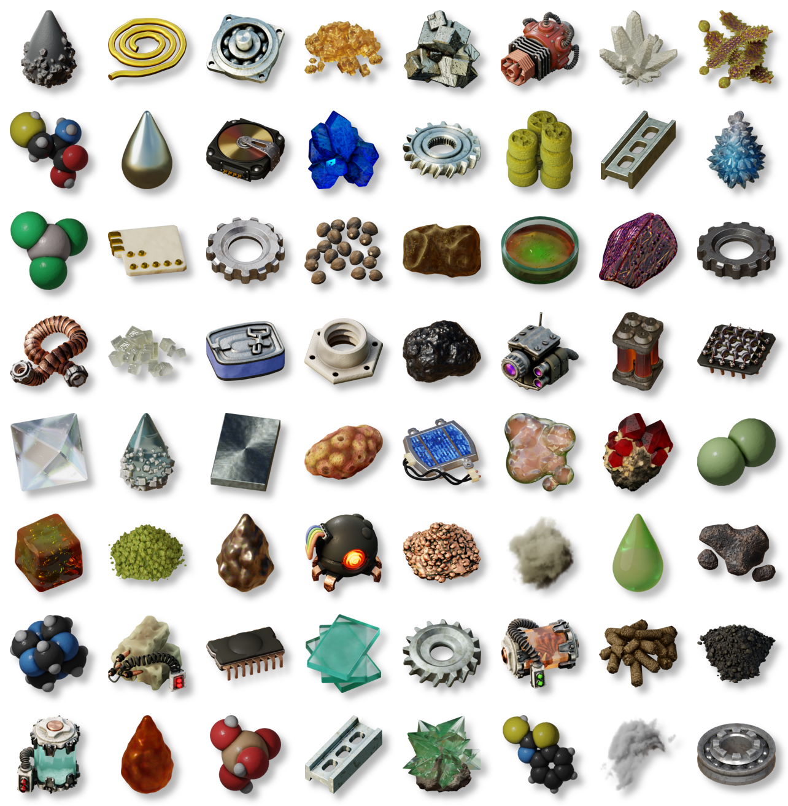

# Unused Renders

Over the past year or so, I've been working on a mod for Factorio. For a small handful of reasons, I'm putting that project on hold for the foreseeable future. I don't want the renders to go to waste, however, so I've uploaded them here for you to use. Some look a lot nicer than others, as a central motivation for the project was to teach myself how to use Blender - specifically, the geometry/shader node systems therein.

For your convenience, I've included reduced-scale and mipmapped versions of every render as well as the full-size originals. Each category is organized into subdirectories, with each mipmapped version having an identical name to their counterpart. Feel free to adapt, edit, repurpose or otherwise transmogrify these images as you see fit. I've tried to give the sprites a sensible naming scheme so that similar kinds of sprites can be found using a local directory search; for instance searching for `metal` would show all metallic items, and `electronic` would show all electronic thingamabobs. The system isn't perfect, but hopefully it's not too difficult to find something that can be of use.

Many renders have similar-looking duplicates of the same object from different angles. In the context of Factorio modding, such images can be used as belt-only item sprites to provide visual variety to items on belts (think how ores look on belts, for instance), while having a consistent inventory icon.

If you have any questions, please don't hesitate to send me a message as a discussion post on this repository, or to the following eMail address: mriley.texture.inquiries@gmail.com

---
The resources in this repository are available under the [Creative Commons Attribution 4.0 International License](https://creativecommons.org/licenses/by/4.0/), as per the [License](LICENSE) included.
